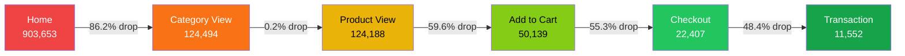
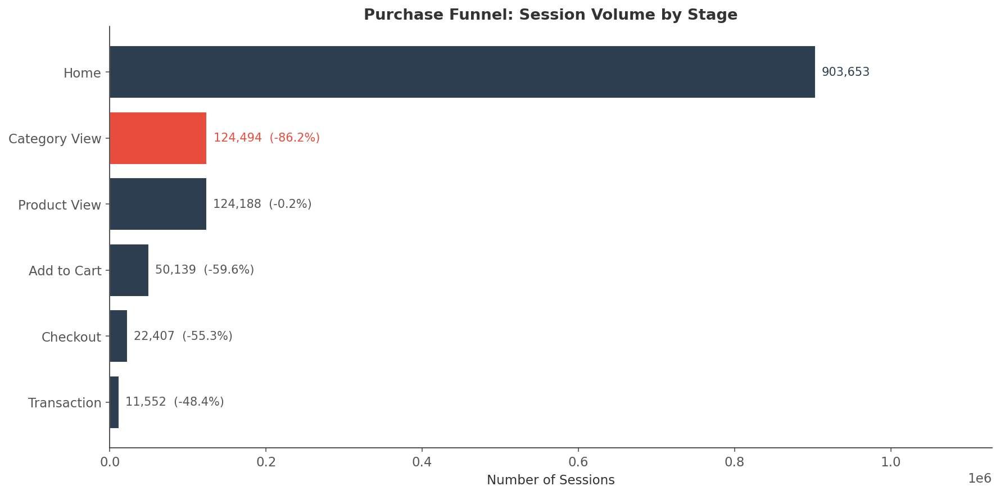
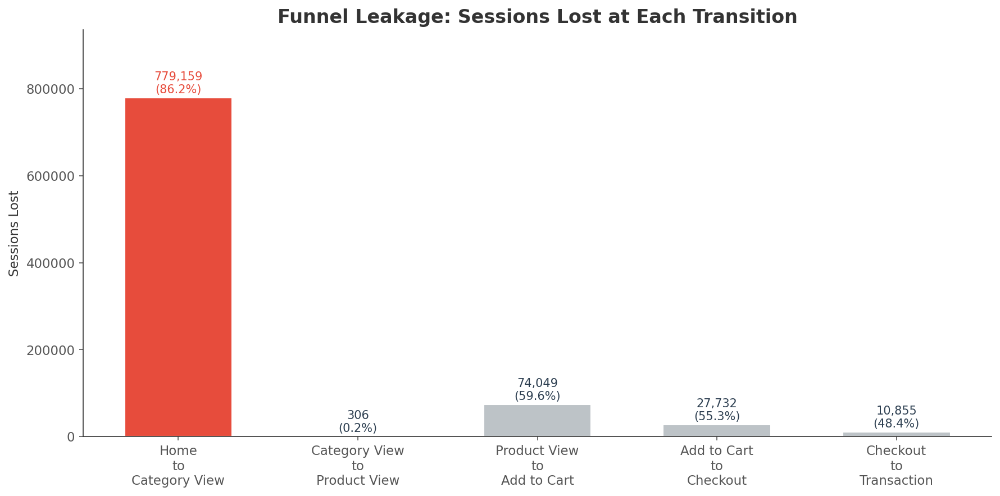
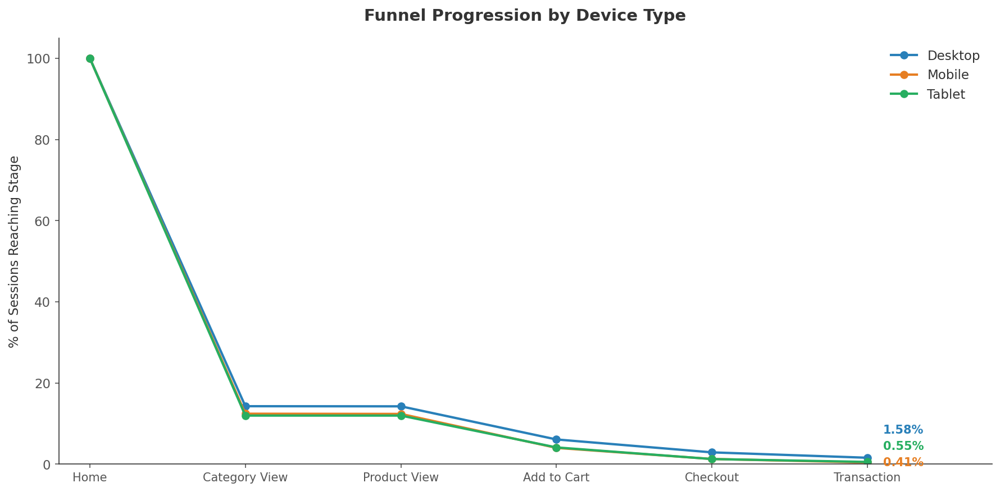
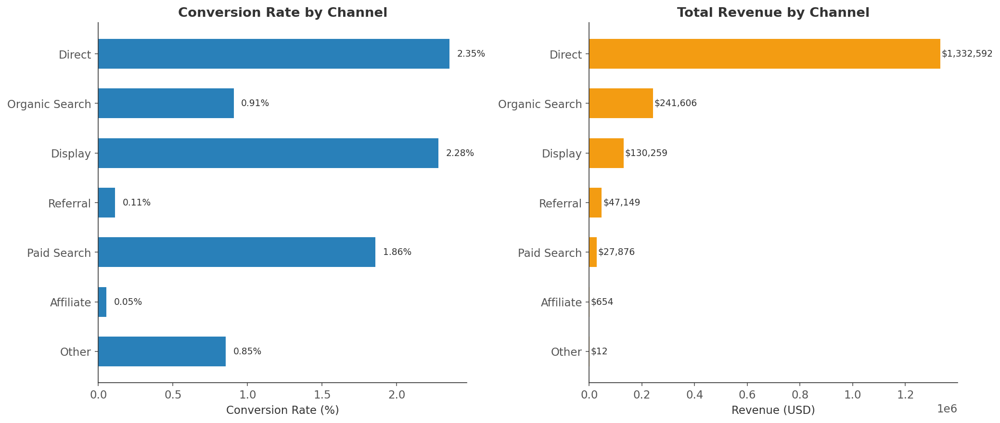
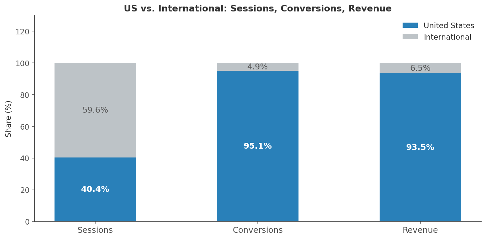
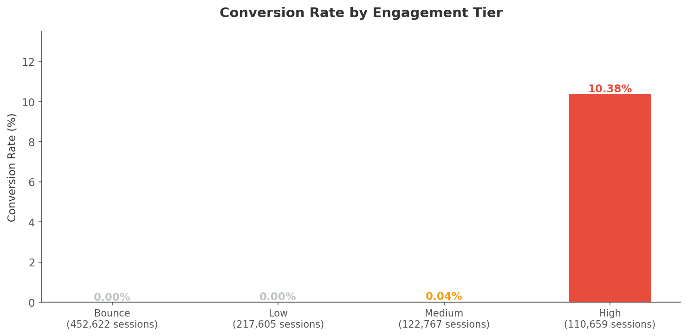
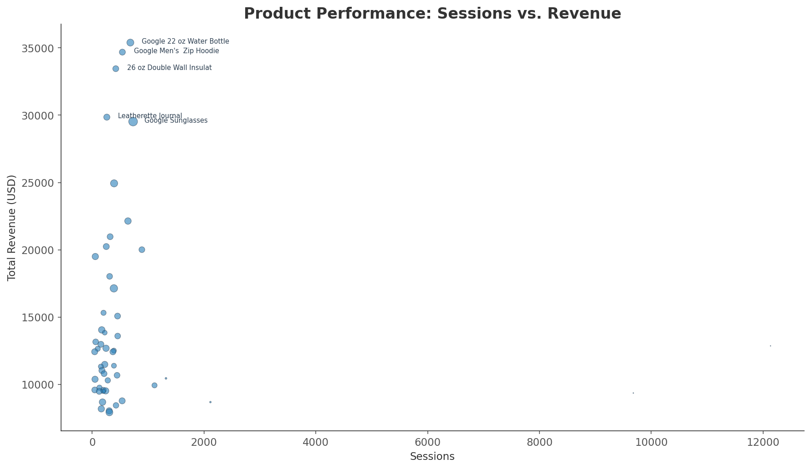

# GA360 E-Commerce Funnel Analysis

> **903,653 sessions. $1.78M in revenue. $379.5K left on the table.**
> This analysis pinpoints the five conversion bottlenecks costing the Google
> Merchandise Store over $375k in addressable revenue and
> lays out a prioritized, statistically validated roadmap to capture it.

---

## The Business Case
The store converts **1.28%** of sessions end-to-end. That number hides five
distinct failure modes, each backed by funnel data and Chi-Squared significance
testing. Fix them in priority order and the model projects ** 2463 additional
transactions (~$379.5K)** in incremental revenue.

| What's Broken | Scale of the Problem | Why It Matters | Estimated Revenue Upside |
|---|---|---|--:|
| Homepage fails to route users into the catalog | 86.2% of sessions drop here (779K sessions lost) | Largest absolute volume leak in the funnel | ~$200,000 |
| Mobile checkout is broken | 0.41% CR vs. 1.58% desktop (p < 0.001) | 23% of traffic, 7.4% of transactions | ~$125,000 |
| Product pages don't convert browsers to buyers | 59.6% view a product but never add to cart | Signals UX friction: pricing, imagery, or social proof gaps | ~$23,500 |
| Referral traffic delivers volume, not value | 29% of sessions, 0.11% CR ($47K revenue) | 21x worse than direct—budget is being wasted | ~$31,000 |
| International traffic can't convert | 59.6% of traffic, 2.4% of revenue | Structural barrier (shipping/currency) or misaligned acquisition | Strategic decision |

---

## Funnel Architecture



The two red to orange transitions, Home → Category View and Product View → Add to Cart, account for the vast majority of lost volume. Everything downstream of Add to Cart converts at reasonable rates. **The problem is upstream, not at checkout.**

---

## Key Findings: 
### 1. The Homepage Is a Dead End, Not a Starting Point
86.2% of sessions never see a product category. The homepage is failing its
primary job: routing visitors into the catalog. This single transition
represents the highest-leverage fix in the pipeline because every
incremental session pushed into Category View compounds through the rest
of the funnel.

**Data-backed Recommendations:** Redesign the homepage to surface category entry
points above the fold. A/B test a "Shop by Category" grid against the current
hero-banner layout. 
Target: reduce drop-off to 75%, adding 101K sessions
to Category View and an estimated **~$200K** in revenue.




---

### 2. Mobile Conversion Crisis: A 3.9× Performance Gap below Desktop

| Device | Sessions | Conversion Rate | Share of Transactions |
|---|--:|--:|--:|
| Desktop | ~694K | 1.58% | ~92.6% |
| Mobile | ~209K | 0.41% | ~7.4% |

This gap is **statistically significant** (Chi-Squared = 1,701; p < 0.001).
Mobile diverges sharply after Product View, meaning the Add to Cart and
Checkout stages carry mobile-specific friction. At desktop-equivalent rates,
mobile would produce **~2,440 additional transactions (~$376K)**.

**Data-backed Recommendations:** Commission a mobile UX audit focused on checkout.
Reduce form fields, add Apple Pay / Google Pay, target sub-3-second page loads,
and ensure tap targets meet accessibility standards. Track via a dedicated
weekly mobile CR KPI. 
Conservative target (0.41% → 0.80%): **~$125K** uplift.



---
### 3. Product Pages Browse Well but Fails to convert
74,049 sessions reach a product page; 59.6% leave without adding to cart.
Users are interested enough to click in, but something on the page kills
momentum. The likely culprits, based on common PDP failure patterns at this
drop-off magnitude: unclear pricing, single-angle photography, absent
reviews, or a buried Add to Cart button.

**Data-backed Recommendations:** Run heatmap analysis (Hotjar or equivalent) to
identify scroll-depth abandonment. Prioritize adding customer reviews,
multi-angle product imagery, inventory urgency signals, and
repositioning the Add to Cart CTA. 
Target: reduce drop-off to 50%, yielding **~$23.5K** in additional revenue.

---

### 4. Budget Optimization: Underperforming Referral Partnerships 
Referral sends 262K sessions (29% of traffic) but converts at **0.11%**—21×
worse than direct (2.35%). That's $47K in revenue from a channel consuming
meaningful acquisition budget. Direct traffic alone accounts for 75% of all
revenue.

**Data-backed Recommendations:** Audit the top 20 referral sources. Terminate or
renegotiate partners converting below 0.05%. Redirect spend toward organic
search (0.91% CR, room to grow) and paid search (1.86% CR, third-highest
converting channel). Implement UTM discipline for sub-source tracking.
Estimated impact: **~$31K** in recovered revenue plus reduced wasted spend.



---

### 5. International Traffic Is Structurally Unable to Convert
The US represents 40% of sessions but **97.6% of revenue**. The remaining
60% of traffic—from India, UK, Canada, Vietnam, Turkey, and others—converts
at under 0.1% collectively. Only Canada shows any traction (0.74% CR).

This isn't an optimization problem; it's a structural one. If the store
doesn't ship internationally or price in local currencies, these sessions
cannot convert regardless of UX quality.

**Data-backed Recommendations:** Make a binary strategic decision: 
(a) invest in localized pricing and shipping for the top 3 viable markets
(Canada, UK, Germany)
(b) deprioritize international acquisition entirely and redirect
spend to US audiences. Either path recovers wasted server and marketing costs.



---

### 6. Engagement Depth as a Conversion Catalyst
Sessions with 7+ pageviews convert at dramatically higher rates than
single-page bouncers. This validates an upstream-first strategy: invest in
navigation and content that keeps users browsing, not just in checkout
optimization.



---

### 7. Product-Level Opportunities
The scatter plot below maps products by traffic volume (x-axis) and revenue
(y-axis). 
- Upper-right quadrant = winners.
- High-traffic / low-revenue products are optimization candidates (better copy, imagery, or pricing).



---

## Recommended Execution Order

| Priority | Initiative | Why This Order | Estimated Impact |
|:-:|---|---|--:|
| 1 | Homepage engagement redesign | Highest volume impact, lowest cost | ~$200K |
| 2 | Product detail page optimization | Second-largest volume leak | ~$123K |
| 3 | Mobile checkout UX overhaul | Statistically validated gap, clear ROI | ~$23.5k |
| 4 | Referral channel audit | Stops budget waste, quick to execute | ~$31K |
| 5 | International market decision | Strategic choice, longer timeline | TBD |

All initiatives should be validated through controlled A/B tests before
full rollout.

**Primary KPIs (weekly cadence):** stage-specific conversion rate, end-to-end
conversion rate, revenue per session, mobile conversion rate.

**Secondary KPIs:** average session pageviews, bounce rate by landing page,
referral source conversion by partner.

---

## Technical Details

### Data Source & Scale

| Metric | Value |
|---|--:|
| Source | `bigquery-public-data.google_analytics_sample` |
| Raw Rows Processed | ~18.6M hit-level records |
| Sessions Analyzed | 903,653 |
| Unique Visitors | 714,167 |
| Date Range | Aug 2016 – Aug 2017 |
| End-to-End Conversion Rate | 1.28% |
| Total Observed Revenue | $1,780,149 |

### Data Engineering
Two SQL queries transform ~18.6M raw hit-level rows into analysis-ready
datasets.

**Query 1 — Session Funnel (903,653 rows):** Aggregates hit-level data into
one row per session with binary flags for the furthest funnel stage reached.
Funnel stages are derived from `hits.eCommerceAction.action_type`:

| Stage | action_type | Description |
|---|:-:|---|
| Home | — | Every session (flag = 1) |
| Category View | 1 | Browsed a product category listing |
| Product View | 2 | Viewed a specific product page |
| Add to Cart | 3 | Added an item to cart |
| Checkout | 5 | Initiated checkout flow |
| Transaction | 6 | Completed purchase |

<details>
<summary>View full SQL — Session Funnel</summary>

```sql
SELECT
  fullVisitorId,
  visitId,
  visitStartTime,
  date,
  device.deviceCategory        AS device_category,
  device.browser               AS browser,
  device.operatingSystem       AS operating_system,
  geoNetwork.country           AS country,
  trafficSource.medium         AS traffic_medium,
  trafficSource.source         AS traffic_source,
  totals.pageviews             AS total_pageviews,
  totals.timeOnSite            AS time_on_site,
  totals.transactions          AS total_transactions,
  (totals.transactionRevenue / 1e6) AS transaction_revenue_usd,

  1 AS reached_home,

  MAX(CASE WHEN hits.eCommerceAction.action_type = '1' THEN 1 ELSE 0 END)
    AS reached_category_view,

  MAX(CASE WHEN hits.eCommerceAction.action_type = '2' THEN 1 ELSE 0 END)
    AS reached_product_view,

  MAX(CASE WHEN hits.eCommerceAction.action_type = '3' THEN 1 ELSE 0 END)
    AS reached_add_to_cart,

  MAX(CASE WHEN hits.eCommerceAction.action_type = '5' THEN 1 ELSE 0 END)
    AS reached_checkout,

  MAX(CASE WHEN hits.eCommerceAction.action_type = '6' THEN 1 ELSE 0 END)
    AS reached_transaction

FROM
  `bigquery-public-data.google_analytics_sample.ga_sessions_*`,
  UNNEST(hits) AS hits
GROUP BY
  fullVisitorId, visitId, visitStartTime, date,
  device_category, browser, operating_system, country,
  traffic_medium, traffic_source,
  total_pageviews, time_on_site, total_transactions,
  transaction_revenue_usd
```

</details>

**Query 2 — Product Performance (3,470 rows):** Unnests `hits.product` to
calculate per-product revenue and session counts, filtered to products with
10+ sessions.

<details>
<summary>View full SQL — Product Performance</summary>

```sql
SELECT
  product.v2ProductName        AS product_name,
  product.v2ProductCategory    AS product_category,
  COUNT(DISTINCT CONCAT(
    CAST(fullVisitorId AS STRING), '-',
    CAST(visitId AS STRING)
  ))                           AS sessions,
  SUM(product.productQuantity) AS purchases,
  SUM(product.productRevenue / 1e6) AS total_revenue_usd

FROM
  `bigquery-public-data.google_analytics_sample.ga_sessions_*`,
  UNNEST(hits) AS hits,
  UNNEST(hits.product) AS product
WHERE
  product.productRevenue IS NOT NULL
GROUP BY
  product_name, product_category
HAVING
  sessions > 10
ORDER BY
  total_revenue_usd DESC
```

</details>

### Statistical Rigor

All segmentation findings (device gap, channel gap) are validated using
Chi-Squared tests of independence. Results with p < 0.001 are flagged as
highly significant. Full test outputs are in `notebooks/funnel_analysis.ipynb`.

---

## Project Structure

```
ga360-funnel-analysis/
├── .gitattributes          # Git configuration for path-specific settings
├── .gitignore              # Specifies intentionally untracked files to ignore
├── LICENSE                 # Legal terms for project usage (MIT License)
├── README.md               # Project overview, funnel architecture, and roadmap
├── requirements.txt        # Python dependencies (pandas, numpy, scipy, etc.)
├── assets/                 # Visualizations and data plots
│   ├── category_revenue.png
│   ├── channel_analysis.png
│   ├── device_funnel.png
│   ├── engagement_conversion.png
│   ├── funnel_volume.png
│   ├── funnel_waterfall.png
│   ├── geo_concentration.png
│   └── product_scatter.png
├── data/                   # Processed datasets for analysis
│   ├── product_performance.csv  # 3,470 product-level revenue records
│   └── session_funnel.csv       # 903,653 session-level funnel records
├── docs/                   # Documentation for stakeholders
│   └── strategy_brief.md   # Executive summary and strategic recommendations
├── notebooks/              # Exploratory Data Analysis (EDA)
│   └── funnel_analysis.ipynb    # Main notebook with statistical rigor (Chi-Squared)
└── src/                    # Source code for the data pipeline
    └── data_pipeline.py    # ETL: Cleaning, processing, and feature engineering
```

---

## Quick Start

```bash
# Clone the repository
git clone https://github.com/your-org/ga360-funnel-analysis.git
cd ga360-funnel-analysis

# Create and activate a virtual environment
python3 -m venv venv
source venv/bin/activate        # macOS/Linux
# venv\Scripts\activate.bat     # Windows (CMD)
# .\venv\Scripts\Activate.ps1   # Windows (PowerShell)

# Install dependencies
python -m pip install --upgrade pip
pip install -r requirements.txt

# Run the ETL pipeline
python src/data_pipeline.py

# Launch the analysis notebook
jupyter notebook notebooks/funnel_analysis.ipynb

# View the Strategy Brief
open strategy_brief.md || xdg-open strategy_brief.md || start strategy_brief.md

```

---

## Dependencies

Python 3.9+ - pandas, numpy, matplotlib, scipy, scikit-learn.
See `requirements.txt` for pinned versions.

---

## License

MIT License. The underlying dataset is sourced from Google BigQuery's public
`google_analytics_sample` and is subject to Google's Terms of Service for
public datasets.
